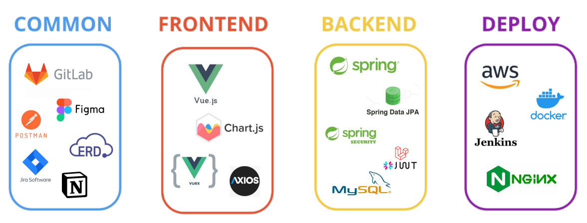
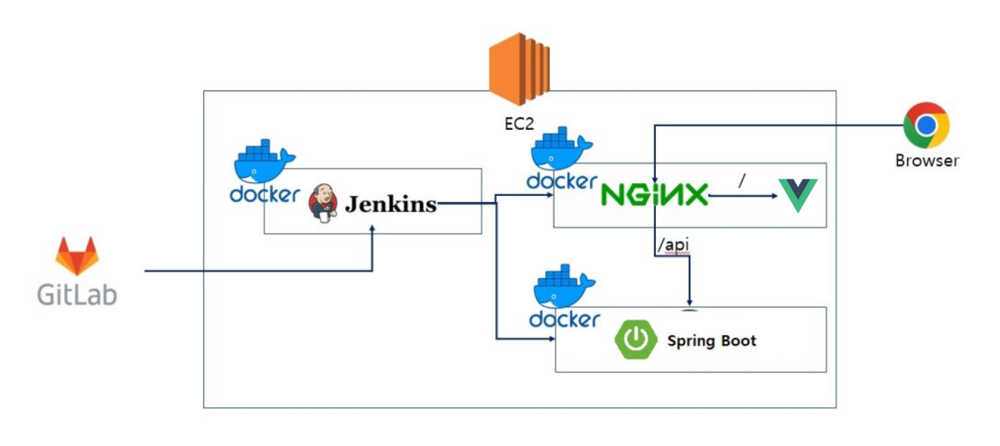
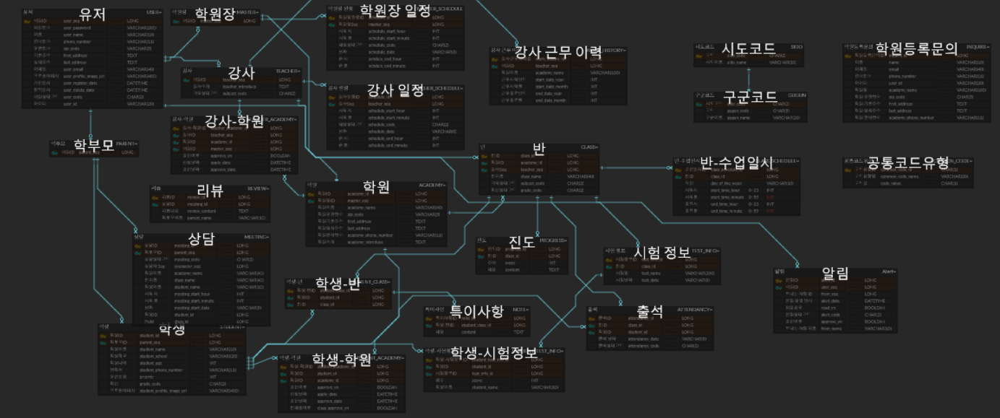
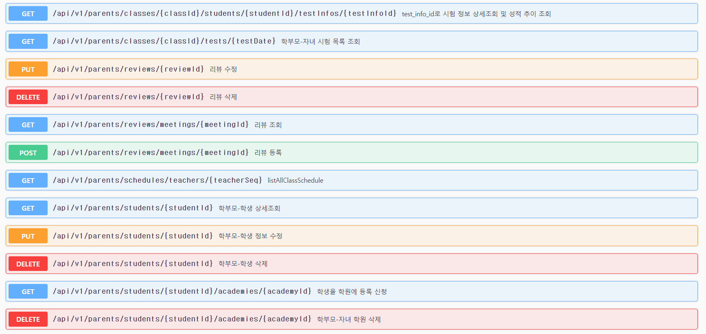
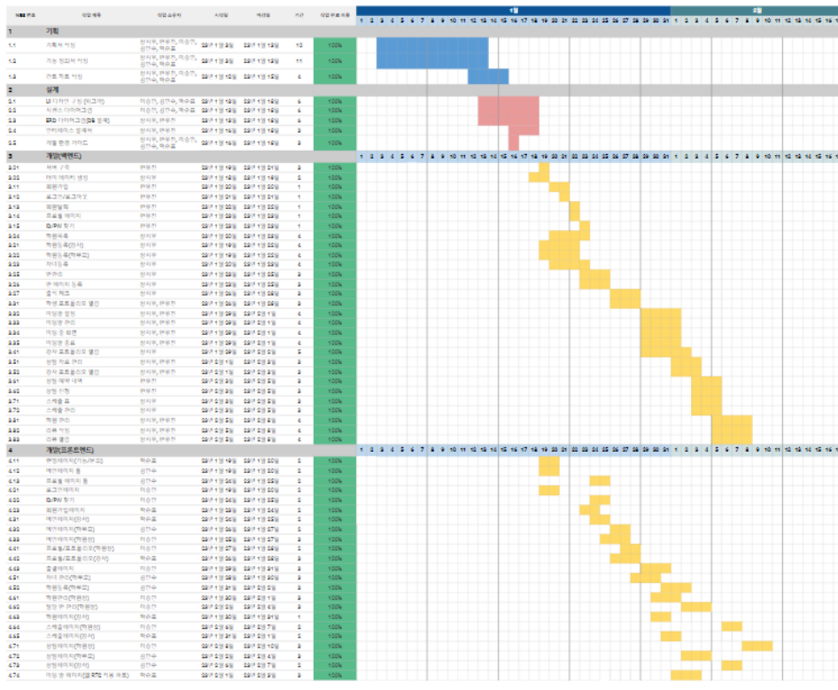
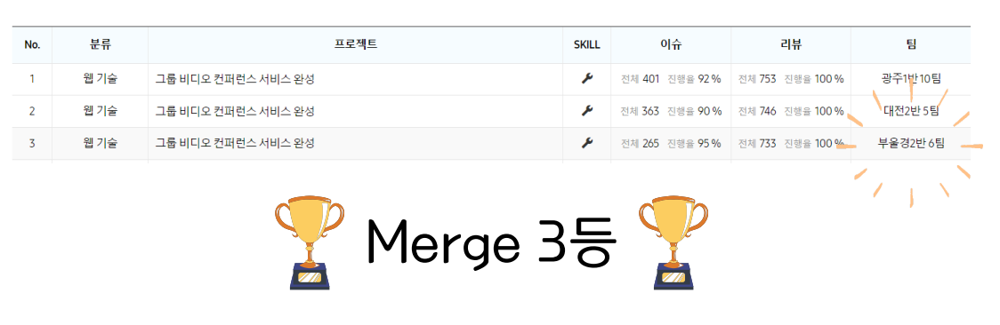

# 1:1 화상 상담 학원 관리 플랫폼 Educal 

# 1. 프로젝트 소개

- 일하느라 자녀 공부를 챙길 겨를이 없는 학부모를 위해!
- 원생 정보들을 관리하기 힘든 강사들을 위해!
- 강사, 원생들을 한 번에 관리하고픈 학원장을 위해!

### Educal이 이 모든 것을 도와드립니다.

 

## 주요 기능

[➡ 상세 기능 살펴보기](./exec/scenario.md)
  

- 바쁜 일정 속 학원에 찾아가기 힘든 학부모들을 위한 학부모, 강사의 **1:1 화상 상담 서비스** 제공
- **학부모**: 자녀의 성적, 출결, 학습 내용, 성적 추이 등 확인 가능
- **강사**: 원생 성적, 출결, 학습 내용, 원생 관리 가능
- **학원장**: 강사, 원생 관리 가능

  

# 2. 기획

## 프로젝트 기술 스택

 

## 프로젝트 아키텍쳐

 

## ERD

 

## API 명세서 (Swagger)

 

## 간트차트

 

## TMI.. 프로젝트 Merge 3등 했습니다.. ^-^👍

 

# 3. 팀원 소개

  <table>
    <thead>
      <th>장시우(팀장)</th>
      <th>반유진(팀원)</th>
      <th>박준표(팀원)</th>
      <th>이승민(팀원)</th>
      <th>김민수(팀원)</th>
    </thead>  
    <tr>
      <td>
        BE  
        디자인  
        성능 개선
      </td>
      <td>
        BE  
        디자인  
        CI/CD  
      </td>
      <td>FE</td>
      <td>FE</td>
      <td>
        FE  
        UCC 제작      
      </td>
    </tr>
  </table>
